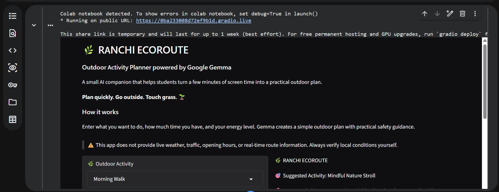
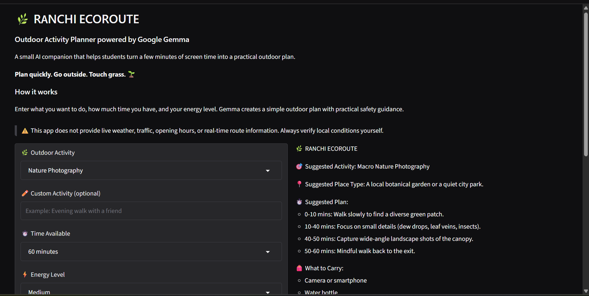

# 🌿 Ranchi EcoRoute

### Outdoor Activity Planner powered by Google Gemma

> A small AI companion that helps students turn a few minutes of screen time into a practical outdoor plan.

**Plan quickly. Go outside. Touch grass. 🌱**
## 🖥️ Demo

The prototype runs from Google Colab and launches a Gradio web interface.

### 🔗 Live Demo

[Open Ranchi EcoRoute](https://ddf9596e4bad103783.gradio.live/)

> ⚠️ The Gradio share link is temporary and may expire. The screenshots and source code are included in this repository for reference.

### Example Input

```text
Outdoor Activity:
Morning Walk

Custom Activity:
Leave blank

Time Available:
45 minutes

Energy Level:
Low

```
## 🤔 Why I Built This

Students often decide they want to go outside, but then spend more time deciding what to do than actually doing it.

Ranchi EcoRoute was built around a simple idea:

**Use a short amount of screen time to create a practical outdoor plan, then put the phone away and go outside.**

The project is designed for students who want a simple activity based on what they want to do, how much time they have, and their current energy level.

## ✨ What It Does

- Accepts an outdoor activity such as walking, hiking, nature photography, jogging, or bird watching
- Allows a custom activity
- Considers available time
- Considers energy level
- Uses Google's Gemma open-weight model to generate an outdoor plan
- Suggests a suitable type of outdoor place
- Creates a simple time-based activity plan
- Suggests practical items to carry
- Provides basic outdoor safety tips
- Includes a screen-break goal to encourage less phone use
- Clearly tells users to verify weather, location access, and local conditions

## 🧠 How It Works

```text
User Input
(Activity + Time + Energy)
          |
          v
     Google Gemma
          |
          v
Outdoor Activity Plan
          |
          v
Suggested Place Type
+ Time-based Plan
+ What to Carry
+ Safety Tips
+ Screen Break Goal
          |
          v
      Gradio UI
```

Gemma handles the natural-language generation of the outdoor plan.

The application also uses simple Python validation and prompt constraints so that the generated plan stays aligned with the user's available time and energy level.

The project intentionally does **not** claim to provide live weather, traffic, opening hours, or real-time route information.

## 🌱 Touch Grass Principle

The goal of the application is simple:

```text
Less screen time
       ↓
Quick plan
       ↓
Go outside
       ↓
More real-world activity
```

The app is meant to make planning the shortest part of the experience.

## 🛠️ Tech Stack

- Python
- Google Gemma 4 31B
- Google AI Studio / Gemini API
- Gradio
- Google Colab

## 🖥️ Demo

The prototype runs from Google Colab and launches a Gradio web interface.

### Example Input

```text
Outdoor Activity:
Morning Walk

Custom Activity:
Leave blank

Time Available:
45 minutes

Energy Level:
Low
```

### Example Output

```text
🌿 RANCHI ECOROUTE

🎯 Suggested Activity:
Mindful Nature Stroll

📍 Suggested Place Type:
A quiet neighborhood park or a tree-lined lane.

⏱️ Suggested Plan:
- 5 mins: Slow stretching and deep breathing.
- 30 mins: Gentle walking at a relaxed pace.
- 10 mins: Sitting quietly and observing the surroundings.

🎒 What to Carry:
- Comfortable walking shoes
- A small water bottle
- A light jacket or shawl

🛡️ Safety Tips:
- Stay on marked paths.
- Be mindful of your surroundings.
- Keep a safe distance from pedestrians.

📵 Screen Break Goal:
Keep your phone in your pocket and use it only for emergencies.

⚠️ Reminder:
Verify weather, location access and local conditions before leaving.
```

## 📸 Screenshots

### Morning Walk



### Nature Photography



## 🔐 API Key Setup

The API key is **not stored in this repository**.

For the Google Colab version, the key is stored using **Colab Secrets**.

Create a secret named:

```text
GEMMA_API_KEY
```

Then enable **Notebook access** for the secret.

## ▶️ How to Run

### 1. Open the notebook

Open:

```text
ranchi_ecoroute.ipynb
```

in Google Colab.

### 2. Add the API key

In Colab:

```text
Secrets → Add new secret
```

Use:

```text
GEMMA_API_KEY
```

Make sure **Notebook access** is enabled.

### 3. Run the notebook

Run the cells in order.

The notebook initializes the Google GenAI client, connects to Gemma, and launches the Gradio interface.

### 4. Create a plan

Enter:

- Outdoor activity
- Optional custom activity
- Available time
- Energy level

Then click:

```text
🌱 Create My Outdoor Plan
```

## 🧪 Testing

The prototype was tested with multiple activity configurations.

### Morning Walk

The app generated a short nature-oriented walking plan for:

```text
45 minutes
Low energy
```

### Nature Photography

The app generated a structured photography-focused outdoor plan for:

```text
60 minutes
Medium energy
```

These tests verified that the model can adapt the activity plan to different goals, time limits, and energy levels.

## 🌱 Why Open Innovation & Gemma Matter

Ranchi EcoRoute uses **Google's Gemma, an open-weight model**, as the core AI component.

The model is responsible for turning a small amount of user input into a personalized outdoor activity plan.

An open-weight approach also leaves room for future experimentation, including:

- Swapping models
- Adapting the model for local use cases
- Exploring local/offline inference
- Running the model in environments with limited connectivity

The project deliberately keeps the experience simple: the AI helps with planning, while the real goal happens away from the screen.

## ⚠️ Safety & Limitations

This is an educational and hackathon prototype.

It does **not** provide:

- Live weather information
- Real-time traffic information
- Live route tracking
- Verified opening hours
- Medical advice

Always verify weather, location access, local conditions, and personal safety before heading outdoors.

## 🏆 Hacktoberfest 2026

This project was built for the **Hacktoberfest Open-Source AI Challenge: Week 1**.

### Theme: Touch Grass 🌿

The challenge asks participants to build something with open-source AI at its core that helps move people from the screen into the real world.

Ranchi EcoRoute follows that theme by keeping the planning process short and encouraging users to spend the majority of their time outdoors.

### Submission Category

**Best Use of Gemma**

The project uses Google's Gemma as its core AI model.

## 📚 What I Learned

The main lesson from this project was that a useful AI application does not need to be complicated.

A small set of inputs, a focused prompt, and a simple interface can turn a general-purpose model into a practical tool for a specific real-world goal.

I also learned the importance of keeping the AI responsible and honest about its limitations, especially when the application could otherwise appear to have access to live information.

## 🚀 Future Improvements

- Real-time weather integration
- Verified local place information
- Map-based route suggestions
- Offline/local Gemma inference
- Personalized activity history
- Better accessibility support
- Group activity planning
- More detailed outdoor difficulty levels

## 📁 Repository Structure

```text
ranchi-ecoroute/
│
├── ranchi_ecoroute.ipynb
├── README.md
└── screenshots/
    ├── morning-walk.png
    └── nature-photography.png
```

## 📄 License

MIT License
